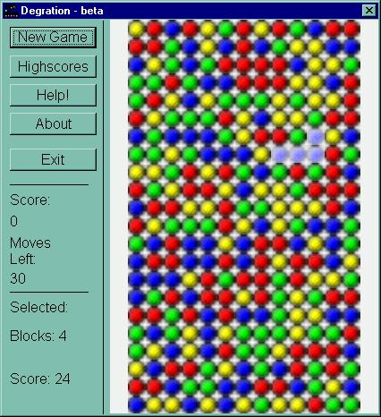



## Degration v1\.0 \(major upgrade\)

### Description

Major upgrade of my previous version. Now it has everything a collapse clone should game. Except for undo and highscores (highscores coming). I fixed the bug where you could select one brick at a time. I made the display bigger w/ smoother graphics, there is now something to explain the gameplay. You can now highlight groups of blocks by moving your mouse over them, the game will also give the ammount highlighted and the potential score. Please comment and report bugs, oh yea, and vote if you like.   p.s. im thinking about and online highscore table.. but have no knowledge of asp, if you can help please feel free to contact me.
 
### More Info
 

             |
---                |---
**Submitted On**   |2002-06-09 18:00:28
**By**             |[poop\_4\_brains](https://github.com/Planet-Source-Code/PSCIndex/blob/master/ByAuthor/poop-4-brains.md)
**Level**          |Intermediate
**User Rating**    |4.2 (25 globes from 6 users)
**Compatibility**  |VB 6\.0
**Category**       |[Games](https://github.com/Planet-Source-Code/PSCIndex/blob/master/ByCategory/games__1-38.md)
**World**          |[Visual Basic](https://github.com/Planet-Source-Code/PSCIndex/blob/master/ByWorld/visual-basic.md)
**Archive File**   |[Degration\_159886692003\.zip](https://github.com/Planet-Source-Code/poop-4-brains-degration-v1-0-major-upgrade__1-46073/archive/master.zip)

